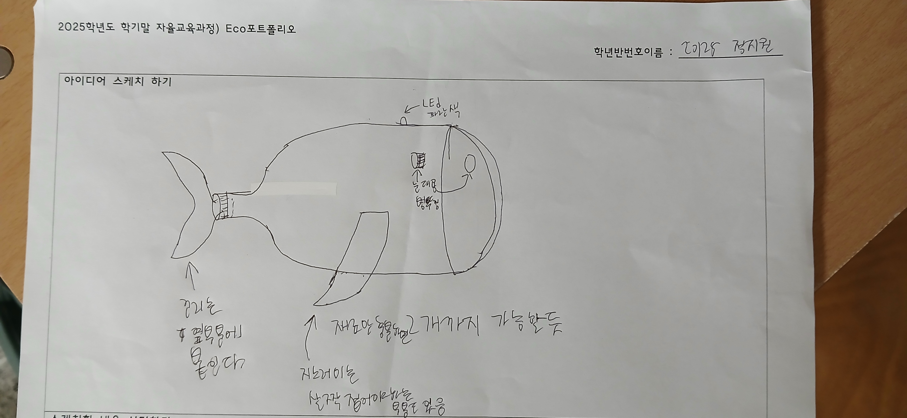
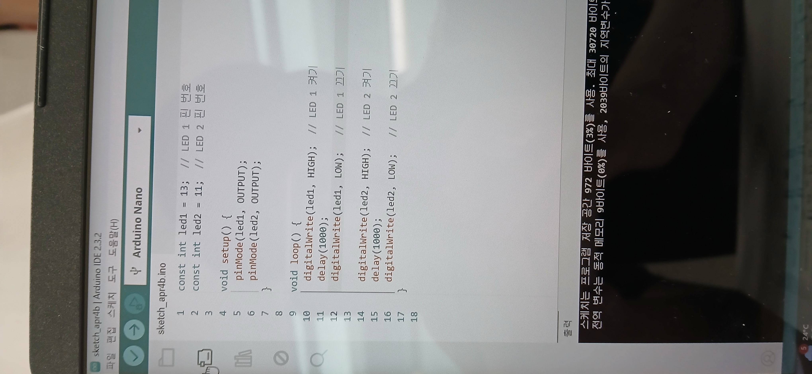
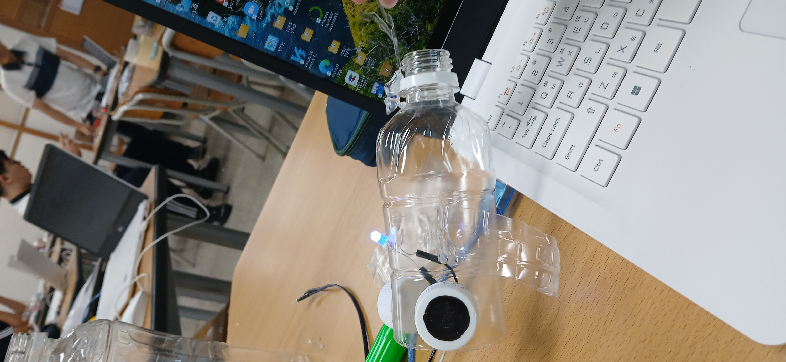

# 🌱 에코아트 프로젝트: [플라스틱 고래?]

## 📖 프로젝트 개요
- **제작자**: [정지원]
- **제작일**: [2025-7-15]
- **소개**
> 요새 바다에 버려지는 플라스틱 쓰래기의 양이 급증해서 그걸 먹고 해양생물들이 고기 반,플라스틱 반이 되어가고 이러다가는 바다에 각종 해양생물이 아니라 각종 플라스틱이 해엄쳐 다니지 않을가 싶어 만들어 봤다.

## 📦 사용 재료
- 아두이노, 가위 , LED, 브레드보드
- 페트병, 그림 도안, 송곳, 글루건,커터칼

## 🔧 제작 과정

### 1단계: 아이디어 스케치

### 2단계: 완성품

## 💭 제작 후기
### 잘된 점
- 구상 도중에는 패트병 3개가 필요하지 않을까 싶어서 무작정 많이 가져왔었는데 예상외로 2개정도면 충분하여 본의아니게 플라스틱을 아낄수 있었다.

### 아쉬운 점
- 분명 처음 구상할떄는 고래였는데 막상 만들고 보니 무슨 날치처럼 생겼었고 LED 설치 경로를 예상못해서 뭔가 부자연스러워졌다.

### 개선할 점
- LED의 연결선이 입 밖에서 튀어나오는게 아니라 몸통 내부 꼬리부분으로 자연스럽게 연결되도록 개선하고 싶다.

### 내가 이미 알고 있었던 것
- 프로젝트떄 사용된 거의 모든게 새롭고 처음보는 것들이라 하는동안 계속 신기했다.

### 새롭게 배운게 된 것
- 아두이노라는 프로그램의 존재,브레드보드라는 물건의 활용법

### 더 알고 싶은 것
- 가능하다면 LED, 브레드보드, 아두이노를 활용한 다른 작품도 한번 만들어 보고 싶다.

## 🌍 환경적 의미
- 고래처럼 플라스틱 오염으로 고통받는 동물들을 떠올리게 하면서 환경 보호 메시지를 전할 수 있다.
- 이미 버려진 플라스틱을 다시 활용한 것이기 때문에 새로운 플라스틱 생산을 줄이고, 폐기물 문제를 완화하는 데 우리가 기여할수 있다.
- "플라스틱은 잠깐, 자연은 영원히."

## 🏷️ 태그
#에코아트 #재활용 #환경보호 #DIY #창의활동

---

> 이 프로젝트는 환경 보호와 창의적 사고를 위한 교육 목적으로 제작되었습니다.
